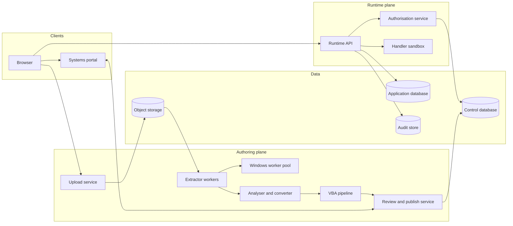

# Access2Web technical design document

| Field | Value |
|---|---|
| Status | Draft for review |
| Owner | Clint Jenkinson |
| Date | 2 October 2026 |
| Version | 0.1 |
| Implements | [Product requirements document](PRD.md) version 0.2 |

## Summary

This document describes how to build Access2Web, a system that converts Microsoft Access databases into web applications, publishes them in the systems portal, and controls who can use each one.

The design rests on one decision: the system does not generate and deploy source code for each application. It generates a versioned **application definition** (a JSON document) and runs every application on one shared, metadata-driven runtime. This choice keeps permission checks, audit logging, and upgrades in one place.

## Status of decisions

The PRD leaves several choices open. This document proposes an answer for each one so that design can proceed. Table 1 lists them. Decisions the owner has accepted are recorded in the [decisions log](DECISIONS.md), which takes precedence over this table.

**Table 1. Proposed decisions**

| Decision | Proposal | Reason | Status |
|---|---|---|---|
| Database engine | PostgreSQL 16 | Row-level security, schemas, and generated columns match the access-control model | Accepted (D3) |
| Sign-in standard | OpenID Connect (OIDC) | Widely supported by portals and directory services | Provisional (D10), depends on the portal |
| Handler language | TypeScript, run in a WebAssembly (Wasm) sandbox | One language across the stack, and a strong isolation boundary | Accepted (D4) |
| Table, data, and query extraction | Jackcess (Java) on Linux, cross-checked with mdbtools and a Python reader | Open source, reads `.mdb` and `.accdb`, and needs no Access licence | Proposed, needs spike 1 |
| Form, report, macro, and VBA extraction | Windows Server worker that drives Microsoft Access with PowerShell | No open source tool found that reads form and report definitions. The owner has run this kind of automation on server operating systems. | Accepted risk (D1, D2). Spike 1 measures stability. |
| AI model for translation | A private model hosted by the organisation, behind a provider interface, on CPU nodes in the cluster unless Spike 4 shows that a GPU server is needed | VBA source can contain credentials and business rules, so it stays inside the network. The cluster has no GPU nodes. | Accepted (D9, D18). Spike 4 tests it. |
| Hosting | RKE2 Kubernetes with Calico, Linux node pools, and a Windows node pool for the worker. The model runs on CPU nodes, or on an external GPU server. | The owner requires deployment on Kubernetes, and the platform is known (D16) | Accepted (D14, D16). Placement of the Windows worker depends on Spike 1. |

## Goals and constraints

The design must meet the requirements in the PRD. These constraints shape it most:

- Permission checks must happen on the server, for every request, and must deny by default.
- Uploaded files and VBA source are untrusted. The system never runs uploaded VBA.
- Conversion is partial by nature. The system must report what it did not convert, and must never hide a gap.
- Each application's data must be isolated from every other application's data.
- The audit log must be append-only.
- The system must deploy on Kubernetes (decision D14), and must not depend on one cloud vendor.

## Architecture overview

Access2Web has two planes:

- **Authoring plane:** imports, analyses, converts, and publishes applications. Application owners use it.
- **Runtime plane:** serves published applications to users. It also enforces permissions and writes the audit log.

Figure 1 shows the components. In the figure, the browser calls the portal and the runtime API. The runtime API calls the authorisation service, the application database, the audit store, and the handler sandbox. The authoring services read uploaded files from object storage and write application definitions to the control database.



**Figure 1. Component overview**

### Components

Table 2 lists each component and its responsibility.

**Table 2. Components**

| Component | Responsibility |
|---|---|
| Upload service | Receives files, checks size and type, scans for malware, and stores the file in object storage |
| Extractor workers | Read tables, data, relationships, indexes, and saved queries from the file without Access |
| Windows worker pool | Export forms, reports, macros, and VBA source as text by using Access automation in a disposable environment |
| Analyser and converter | Builds the application definition, migrates data, and produces the conversion report |
| VBA pipeline | Classifies procedures, applies fixed mappings, and calls the translation service |
| Review and publish service | Shows the conversion report and handler reviews, hosts the editor for drafts, records approvals, publishes versions, and registers the application with the portal |
| Runtime API | Serves every published application, and applies permissions and audit logging |
| Authorisation service | Resolves effective permissions for a user and an object |
| Handler sandbox | Runs approved handlers with a restricted host interface |
| Control database | Holds platform metadata: applications, versions, grants, and approvals |
| Application database | Holds migrated data, with one schema for each application |
| Audit store | Holds the append-only audit log |

## Application definition

The application definition is the central artefact. The analyser writes it, the review service lets owners edit it, and the runtime interprets it. It is versioned and immutable after publication.

A definition contains:

- Entities (tables), with fields, types, keys, and relationships.
- Query views, stored as translated PostgreSQL SQL with typed parameters.
- Forms, as a tree of layout nodes and bound controls.
- Reports, as grouping, sorting, and layout rules.
- Rules: validation, defaults, and show or hide conditions, in a small declarative expression language.
- Handlers: references to approved TypeScript modules, keyed by the event that triggers them.
- Conversion notes: the status and reason for each source object.

The following excerpt shows the shape of a definition:

```json
{
  "app": "inventory",
  "version": 3,
  "entities": [
    { "name": "Product", "fields": [
      { "name": "ProductId", "type": "serial", "key": true },
      { "name": "Price", "type": "numeric(19,4)", "required": true }
    ]}
  ],
  "forms": [
    { "name": "ProductForm", "source": "Product", "controls": [
      { "type": "text", "bind": "Price",
        "rules": [{ "validate": "value >= 0", "message": "Price must not be negative" }] }
    ]}
  ],
  "handlers": [
    { "event": "ProductForm.BeforeUpdate", "module": "handlers/product-before-update.ts", "approvedBy": "owner" }
  ]
}
```

### Why not generate source code

The design considered generating a code project for each application. It rejected this for three reasons:

- Each generated project would need its own build, deployment, and security review.
- Permission and audit code would be duplicated across applications, so a fix would need to reach every application.
- Owners would edit generated code, and the system could no longer re-import an updated database safely.

The cost of the chosen design is that the runtime must support every control and rule type the converter can emit. The runtime must therefore be the most thoroughly tested part of the system.

## Import and extraction

### Two-tier extraction

The Access file format is not publicly documented, and the open source tools differ in what they read. The system therefore uses two tiers:

1. **Native tier.** Open source libraries read tables, data, relationships, indexes, and saved query SQL on Linux. No Access licence is needed.
2. **Automation tier.** A Windows Server worker opens the file in Microsoft Access and exports forms, reports, macros, and modules as text by using the `SaveAsText` method. The exported text is the input to the converter.

Table 3 lists the open source tools that apply to the native tier.

**Table 3. Open source tools for the native tier**

| Tool | Language | Reads | Limits |
|---|---|---|---|
| [Jackcess](https://jackcess.sourceforge.io/) | Java | Tables, data, relationships, indexes, read-only query information, passwords, and complex types, for `.mdb` and `.accdb` from Access 2000 to 2019 | Does not read form, report, or VBA definitions |
| [UCanAccess](https://ucanaccess.sourceforge.net/site.html) | Java | Everything Jackcess reads, with a JDBC interface and SQL execution through HSQLDB | SQL runs in HSQLDB, so results can differ from Access. Useful as a test aid, not as the source of truth. |
| [mdbtools](https://github.com/mdbtools/mdbtools) | C | Tables, data, schema, properties, and saved query SQL, for `.mdb` and `.accdb` | Small SQL subset. Use as a cross-check on Jackcess. |
| [access-parser](https://pypi.org/project/access-parser) | Python | Tables and data | No encryption support, and it parses the whole file into memory |
| pyaccdb | Python | Tables and data, including password-protected files with Agile Encryption | Read-only, and it is not a SQL engine |

The primary choice is Jackcess, because it has the widest coverage and an active release history. The other tools are cross-checks and test aids. The survey found no open source tool that reads form or report definitions, so the automation tier remains necessary for forms and reports.

The VBA position is less clear. Public write-ups describe compressed VBA streams inside `.accdb` files that a tool can detect and decompress, which could remove the need for Access for VBA source. No maintained tool was found, and the survey did not verify the method. Spike 1 includes a time-boxed attempt, because success would make VBA extraction possible on Linux.

### Automation tier on Windows Server

The owner has automated Access with PowerShell on server operating systems, and the worker builds on that experience. Two constraints remain:

- Microsoft does not support unattended Automation of Office applications, and states that Office can be unstable or deadlock in that setting. The Access Runtime and the Database Engine Redistributable count as Office components. See [Considerations for server-side Automation of Office](https://support.microsoft.com/help/257757).
- Microsoft states that using server-side Automation to provide Office functionality to unlicensed workstations is not covered by the end user licence agreement. The organisation must confirm that its licensing covers this use.

The worker design must therefore assume that Access can hang or crash. It must apply a time limit to each job, kill the process on timeout, and restart the environment between jobs. Spike 1 measures how often failures occur.

No one has verified that the two tiers together cover every Access version and feature the organisation uses. Spike 1 must test them on real files before the design is final. If the organisation cannot accept the automation tier, the system loses form, report, and VBA conversion unless the native VBA method works, and the PRD scope must change.

### Isolation of the Windows worker

Opening an untrusted file in Access is a risk, so the worker pool applies these controls:

- Each job runs in a fresh, disposable environment that is destroyed after the job. The environment is a VM, or a Hyper-V-isolated Windows container if Spike 1 shows that it is acceptable.
- The environment has no network access, and no credentials.
- The worker sets the automation security level to force-disable macros before opening the file, so no `AutoExec` macro or VBA runs.
- The worker enforces a time limit and a memory limit for each job.
- The worker copies only the exported text out of the environment.

### Data migration

The converter creates one PostgreSQL schema for each application, and loads rows in batches. Table 4 lists the type mapping.

**Table 4. Access to PostgreSQL type mapping**

| Access type | PostgreSQL type | Note |
|---|---|---|
| Short Text | `varchar(n)` | Uses the field size from the source |
| Long Text | `text` | Rich text is stored as HTML |
| Number (Byte, Integer) | `smallint` | Byte maps to `smallint` because PostgreSQL has no one-byte integer |
| Number (Long Integer) | `integer` | |
| Number (Single, Double) | `real`, `double precision` | |
| Number (Decimal) | `numeric(p,s)` | |
| Currency | `numeric(19,4)` | |
| Date/Time | `timestamp` | Access has no time zone, so none is assumed |
| Yes/No | `boolean` | |
| AutoNumber | `integer generated by default as identity` | The sequence starts above the highest migrated value |
| Hyperlink | `text` | |
| OLE Object, Attachment | Object storage reference | Binary data moves to object storage, with a reference in the row |
| Multi-value field | Junction table | |
| Calculated field | Generated column, or a view column | Falls back to a conversion note if the expression cannot translate |

The migration must also:

- Create primary keys, foreign keys, indexes, and required-field constraints.
- Reconcile row counts for every table, and fail the job if counts differ.
- Report orphaned rows that violate a relationship, instead of dropping them.

### Query translation

Access queries use Jet SQL, which differs from PostgreSQL. The converter includes a Jet SQL parser and a transpiler. It must handle at least:

- `IIf` to `CASE`, `Nz` to `COALESCE`, and `&` concatenation to `||`.
- `#` date literals, and `*` and `?` wildcards in `LIKE`.
- `Format`, `DateAdd`, `DateDiff`, `Left`, `Mid`, and similar functions, through a function map.
- `TRANSFORM` and `PIVOT` (crosstab queries), through a pivot step in the runtime.
- Parameter queries, converted to typed, bound parameters.
- Domain aggregate functions such as `DLookup`, converted to subqueries.

When a query uses a construct the transpiler does not support, the converter marks the query as not converted and records the reason. The transpiler must never emit a query it cannot test.

## VBA pipeline

The pipeline never executes VBA. It works on exported source text only.

### Stages

1. **Parse.** Parse each module into procedures, and link each procedure to the form, report, or control that calls it.
2. **Classify.** Assign each procedure to one of the three classes in the PRD: standard pattern, translatable logic, or manual redesign. Classification uses rules first, for example any reference to `CreateObject`, `Declare`, or `Open ... For` marks a procedure as manual redesign. A model classifies only the procedures the rules cannot decide.
3. **Map.** Convert standard patterns to declarative rules by a fixed mapping. For example, `Me.Field.Visible = False` becomes a show or hide rule. No model is involved.
4. **Translate.** Send translatable procedures to the translation service. The request includes the procedure source, the entity and field definitions it uses, and the handler interface.
5. **Check.** Parse the generated TypeScript, and reject it if it uses anything outside the handler interface.
6. **Test.** Run the tests in the sandbox, and record results.
7. **Review.** Show original and generated code side by side. The owner approves or excludes each handler.

### Handler interface

A handler receives a context object and can call only the functions the host provides:

- `ctx.user`: the user's identity and roles, read-only.
- `ctx.record`: the current record, with the old and new values for update events.
- `db.query(sql, params)`: a parameterised query, limited to the application's schema and filtered by the user's permissions.
- `ui.message(text)`, `ui.setVisible(control, value)`, and similar calls that return instructions to the browser.

Handlers have no network, file system, clock, or random-number access beyond the host functions. This is what makes a handler safe to run with real data.

### Tests

The system generates test cases from the procedure and from sample rows. The original code is not available as an oracle, because the system does not run it. The test report therefore shows each case as an input and an expected output, and the owner confirms or corrects each expected output during review. A test the owner has not confirmed does not count towards approval.

### Sandbox

The sandbox runs handlers in a Wasm JavaScript engine, such as QuickJS compiled to Wasm. Each call:

- Starts from a clean instance.
- Has a time limit and a memory limit.
- Cannot import modules except the host interface.
- Writes data only through the transaction that the runtime API owns, so a failed handler rolls back with the request.

### Translation service

The translation service is an interface with a private, locally hosted model as the first implementation. A hosted AI service stays possible as a second implementation only if the data policy owner approves it. Decision D9 in the [decisions log](DECISIONS.md) records this choice. The pipeline must strip string literals that match credential patterns before it sends source to any model, and must log every request.

#### Local model approach

A survey of 2026 sources suggests that a local model is feasible, but the quality varies with size. The sources are blog posts and research papers, and the design has not verified their figures. The points that shape the design are:

- Open-weight code models in the 14 billion to 30 billion parameter range are the practical target. One study found that 7 billion parameter models failed to produce compilable output for API-aware translation, while a 14 billion parameter model reached a compile rate of about 46%. The study did not translate VBA, so the figure is only an indication.
- Candidates include the Qwen3-Coder family, which is released under the Apache 2.0 licence. A 30 billion parameter mixture-of-experts version has only 3 billion active parameters, and an 80 billion parameter version (Qwen3-Coder-Next) needs about 46 GB of memory, according to the sources. The team must confirm the licence and availability of any model at the start of Spike 4.
- At 4-bit quantisation, a model needs about half a byte of memory for each parameter, plus 4 to 8 GB for the attention cache at a 32,000-token context. A 32 billion parameter model therefore needs about 20 GB, so a single 24 GB GPU suits models up to about 30 billion parameters with a short context.
- vLLM suits production serving on GPUs with several concurrent requests. Ollama and llama.cpp are simpler, and llama.cpp also serves models on CPU, which the cluster requires. Translation is a batch task with a human reviewer, so throughput and response time matter less than accuracy.
- Studies report that supplying the domain model (entities and fields) and similar worked examples improves results. The request format in stage 4 already includes the entity and field definitions, and the pipeline adds retrieved examples of approved translations.

The pipeline compensates for a weaker model in these ways:

1. Fixed mappings handle standard patterns, so the model never sees them.
2. A bounded repair loop returns parse errors and failed tests to the model, with a limit of three attempts.
3. The classifier sends any procedure that uses automation of other programs, Windows API calls, or the file system to manual redesign, so the model does not invent a translation.
4. The owner reviews every handler, so a wrong translation does not publish without a person approving it.

## Authorisation

### Model

A **grant** gives a **subject** a **permission level** on a **resource**. The design uses these definitions:

- A subject is a user, a directory group, or a role.
- A resource is an application, or an object inside it: a table, a form, or a report.
- A permission level is one of the seven levels in the PRD.

### Resolving permissions

To decide whether a user can do an action on an object, the authorisation service applies these rules in order:

1. Collect the user's identities: the user, the user's groups, and the user's roles.
2. If any grant for those identities exists on the object itself, use only the grants on that object.
3. Otherwise, use the grants on the application.
4. Allow the action if any collected grant includes the required level.
5. If no grant applies, deny.

Version 1 has no explicit deny grants. Whether the organisation needs them is an open question.

### Enforcement

The system enforces permissions in three places:

- **Portal tile list.** The portal adapter returns only applications on which the user has the open level.
- **Runtime API.** Every request resolves permissions before it runs. No route skips this step.
- **Database.** Row-level rules compile to PostgreSQL row-level security (RLS) policies. For each request, the runtime sets the user identity as a transaction-local setting, so the policy applies even if an API bug builds the wrong query.

### Changes without sign-in

The token carries identity only. The authorisation service resolves groups and grants on the server, and caches them for at most 60 seconds. A change to a grant or group membership publishes an invalidation event, so a permission change takes effect within the cache time and the user does not need to sign in again.

### Default deny

A published application has no grants until the owner adds them. The publish screen shows a summary of who can open the application and requires the owner to confirm it. The owner must also confirm the data classification that the system recorded at upload. Publishing is blocked until the owner does both.

## Portal integration

The system defines a `PortalAdapter` interface so the design does not depend on one portal product. The interface has these operations:

- `register(app)`: creates or updates a tile with the name, description, icon, owner, and launch link.
- `unregister(appId)`: removes the tile.
- `visibleTo(userId)`: returns the tiles a user can see.
- `identity(request)`: validates the sign-in token and returns the user and groups.

The launch link has the form `/apps/{slug}`. A user who opens the link without permission gets a page that states they do not have permission and names the application owner.

The portal's API is an assumption in the PRD, and the adapter is the place to absorb its differences. Confirm the portal's integration options before build starts.

## Audit

The runtime writes audit events for sign-in, record changes, report runs, exports, permission changes, and publishing.

For record changes, database triggers capture the old and new values in the same transaction as the change. This design means that no code path can change data without an audit row, and a rolled-back change leaves no row.

The audit store has these properties:

- The application's database roles have insert permission only, with no update or delete.
- Each event stores a hash of the previous event, so removal or change is detectable.
- Tables are partitioned by month, so queries and retention stay manageable.
- Auditors read through a separate role, with search and export.

## Application editing

The definition model makes editing after migration a controlled change to a document, not a code change. An owner or designer edits a draft of the definition, and the system publishes the draft as a new immutable version.

### Draft and version model

The system holds these states for an application:

- **Published versions.** Immutable. Exactly one is current. The runtime serves the current version.
- **Draft.** Mutable. Each application has at most one active draft, which a designer locks while editing. Other designers can view the draft but not change it.

A draft starts as a copy of the current version. The editor records each change as an operation (for example, "rename field `Price` to `UnitPrice`"), not only as a before-and-after difference. A difference cannot tell a rename from a drop followed by an add, and a rename must keep its data.

### Edit surfaces

The editor provides these surfaces, in this order of delivery:

1. Forms: controls, labels, visibility, defaults, and validation rules.
2. Data: tables, fields, types, and constraints.
3. Queries and reports: columns, filters, grouping, and sorting. The editor offers a builder first, and a SQL view for experienced designers.
4. Handlers: a code editor with the sandbox and test runner, under the approval rules in the VBA pipeline.

Spike 5 tests the form editor and the operation model before the build. The editor renders user-entered text, such as labels and messages, with escaping, so that an edit cannot inject script into other users' browsers.

### Publishing a draft

To publish a draft, the system:

1. Validates the draft: the definition conforms to its schema, every control binds to an existing field, every query translates and runs, and every handler passes its tests.
2. Computes the data changes from the recorded operations, and classifies each one as shown in Table 5.
3. Runs a dry run on a copy of the affected tables for any destructive change, and shows the affected row counts to the owner.
4. Requires owner confirmation of destructive changes, and takes a snapshot of the application's schema.
5. Applies all data changes in one transaction. PostgreSQL supports transactional schema changes, so a failure leaves the schema unchanged.
6. Creates the new immutable version, and makes it current in one atomic step.
7. Writes an audit event with the difference, the person who published, and the snapshot reference.

Table 5 lists the classes of data change and how each is handled.

**Table 5. Classes of data change**

| Class | Examples | Handling |
|---|---|---|
| Additive | Add a table, add a nullable field, add a control, add a rule | Apply automatically on publication |
| Compatible | Widen a text field, rename a table or field, add a default | Apply after the owner reviews a preview. A rename keeps the data by renaming in place. |
| Destructive | Drop a table or field, narrow a type, add a required constraint to a field that holds empty values, change a key | Require owner confirmation, a dry run, and a snapshot before applying |

A change that rewrites a large table can lock it. The system runs such a change in a maintenance window that the owner chooses.

### Rollback

Rollback depends on the kind of change:

- **Definition-only changes.** Making an earlier version current is instant.
- **Additive changes.** The earlier version still runs, because the added tables and fields are ignored by that version.
- **Renames and destructive changes.** The earlier version cannot run against the changed schema. The only route is to restore the snapshot, which loses every change to the data since the snapshot. The rollback screen must say so and require confirmation.

### Open sessions during publication

The runtime validates every request against the current version. When a user has a form open from an earlier version, the runtime returns a version-changed response, and the browser asks the user to reload. The runtime does not apply an old form's changes to a field that no longer exists.

### Authorisation and audit

The Design application level lets a person create and edit a draft. Only the Manage application level lets a person publish. A person with both levels can edit and publish their own draft unless the application is set to require a second approver. Version 1 does not require one by default (decision D13), but the setting exists for each application. The audit store records draft creation, each published version, rollbacks, and snapshot use.

### Relationship to re-import

Re-import from the original `.accdb` file (FR-12) conflicts with editing, because the source file and the edited application diverge. The design makes the web application the system of record after the first published edit. Re-import then stays available only for an application with no published edits. An owner who wants to re-import an edited application creates a separate application. The owner accepted this as decision D12.

## Platform data model

Table 6 lists the main tables in the control database.

**Table 6. Control database tables**

| Table | Purpose | Key columns |
|---|---|---|
| `applications` | One row for each application | `id`, `slug`, `name`, `owner_id`, `current_version` |
| `app_versions` | Immutable published definitions | `app_id`, `version`, `definition`, `published_at`, `published_by` |
| `app_drafts` | One mutable draft for each application | `app_id`, `base_version`, `operations`, `locked_by`, `updated_at` |
| `schema_changes` | Data changes applied at publication | `app_id`, `to_version`, `class`, `migration`, `snapshot_ref`, `applied_at` |
| `import_jobs` | Upload and conversion runs | `id`, `app_id`, `status`, `source_object_key` |
| `conversion_items` | One row for each source object | `job_id`, `object_type`, `name`, `status`, `reason` |
| `handlers` | Translated procedures | `app_id`, `procedure`, `class`, `source`, `generated`, `approved_by`, `approved_at` |
| `grants` | Permission grants | `subject_type`, `subject_id`, `resource_type`, `resource_id`, `level` |

## API outline

Table 7 lists the main API groups.

**Table 7. API groups**

| Group | Example operations | Caller |
|---|---|---|
| Authoring | Create an import job, get the conversion report, create and edit a draft, compare versions, approve a handler, publish, roll back | Application owner, application designer |
| Administration | Manage roles, view all applications, unpublish | Platform administrator |
| Permissions | List, create, and delete grants | Application owner, platform administrator |
| Runtime | Read, create, update, and delete records, run a query view, run a report, export | Application user |
| Audit | Search and export events | Auditor |

Runtime routes use the form `/api/apps/{slug}/...`. Every response for a denied request uses the same status and message, so a user cannot tell whether a hidden application exists.

## Threats and mitigations

Table 8 lists the main threats and how the design addresses them.

**Table 8. Threats and mitigations**

| Threat | Mitigation |
|---|---|
| Uploaded file carries malware | Scan on upload, and open files only in disposable environments or in a parser with no network |
| Embedded macro runs when Access opens the file | Force-disable automation security, and run in an environment that is destroyed after the job |
| Generated handler leaks or destroys data | Sandbox, restricted host interface, time and memory limits, owner review |
| SQL injection through translated queries or handlers | Bind all parameters, and reject string-built SQL in generated code |
| User reads another application's data | One schema and one database role for each application, plus RLS |
| User bypasses the interface and calls the API | Server-side permission checks on every route |
| Audit log tampering | Insert-only roles and a hash chain |
| Credentials in VBA source leave the network | Strip credential patterns, log requests, and offer a private translation deployment |

## Deployment on Kubernetes

The system deploys on Kubernetes (decision D14). Kubernetes provides scheduling, scaling, rolling updates, and self-healing for the stateless Linux services. Two components do not fit as cleanly: the Windows worker, because Access runs only on Windows, and the translation model, because it needs a GPU.

### Cluster platform

The platform team confirmed these facts (decisions D16 and D17):

- The cluster runs RKE2, at the latest release. Record the exact version at the start of the spikes.
- The cluster offers Windows nodes and has no GPU nodes.
- Calico provides the network plugin and network policy.
- PostgreSQL runs as its own container in the cluster.
- Object storage is S3-compatible.
- Passwordstate is the secrets repository.
- The container registry is an on-premises ProGet server.

### Workloads

Table 9 lists each component with its Kubernetes workload, node pool, and scaling method.

**Table 9. Kubernetes workloads**

| Component | Workload | Node pool | Scaling |
|---|---|---|---|
| Runtime API | Deployment | Linux | Autoscale on CPU and request rate, with at least two replicas |
| Authorisation service | Deployment | Linux | Autoscale, with at least two replicas |
| Handler sandbox | Wasm engine inside the runtime API pods, or a separate Deployment if isolation tests require it | Linux | Scales with the runtime API |
| Upload service | Deployment | Linux | Autoscale |
| Review, edit, and publish service | Deployment | Linux | At least two replicas |
| Extractor workers, analyser and converter, VBA pipeline | Job for each import, or a Deployment that reads a queue | Linux | Scale on queue depth |
| Translation model | Deployment on a high-memory CPU node pool, or an external GPU server behind the same interface | Linux (high memory) | One replica for each model instance, scaled by hand in version 1 |
| Windows worker | Job for each import | Windows, or outside the cluster | Scale on queue depth, limited by the number of Windows nodes |
| Connection pooler | Deployment | Linux | At least two replicas |
| PostgreSQL | StatefulSet in the cluster, managed by an operator | Linux with fast storage | One primary and at least one replica |
| Object storage | S3-compatible service provided by the organisation | Not applicable | Not applicable |

### Windows worker placement

The worker takes import jobs from a queue and writes the exported text to object storage. Because this interface does not depend on where the worker runs, two placements are possible with no other change:

- **Windows node pool in the cluster.** RKE2 supports Windows worker nodes with Calico, and the organisation's cluster offers them (decision D16). The worker runs as a Kubernetes Job, scheduled by taints and node selectors. RKE2 documents Windows Server 2019 LTSC and 2022 LTSC as validated versions, so confirm that the nodes run one of these. For process isolation, the container image build must match the node's Windows build. Windows pods cannot run privileged. Hyper-V isolation through a runtime class would give a VM-like boundary, but the survey found only older sources, which described that work as slow, so its status is unverified. Spike 1 tests it.
- **External Windows VM pool.** The worker runs outside the cluster and reads the same queue. This placement keeps the VM isolation of the original design, and removes any dependence on Windows support in the cluster.

The design builds to the queue interface and chooses the placement after Spike 1 (decision D15). A process-isolated Windows container shares the host kernel, which is a weaker boundary for untrusted files. Do not use it unless the security owner accepts the risk.

### Translation model placement

The cluster has no GPU nodes, so the model runs on CPU. The design offers two placements behind one interface:

- **High-memory CPU node pool in the cluster.** The model runs under llama.cpp or a similar CPU server. A mixture-of-experts model with about 3 billion active parameters is the practical choice, because CPU speed depends on how many bytes the CPU reads for each token. Sources report about 8 to 15 tokens per second for such a model on consumer CPUs at 4-bit quantisation. A dense 14 billion parameter model reads about five times as much memory for each token and runs slower. The sources did not test server CPUs, so Spike 4 measures the speed. Translation is a batch task with a human reviewer, so these speeds can be acceptable.
- **External GPU server.** If Spike 4 shows that CPU speed or quality is not enough, the model runs on a GPU server outside the cluster. This needs a budget decision (open item O5).

Model weights load from object storage or a persistent volume at start-up, which can take minutes, so the readiness probe must wait for the load. Only the VBA pipeline pods can call the model, and the model pod has no outbound network access.

### Packaging and configuration

The deployment uses these conventions:

- Every Linux component is a container image, built reproducibly, scanned for vulnerabilities, and stored in the organisation's ProGet registry. ProGet supports Windows containers, but Windows base image layers are marked as non-distributable and are skipped on push, so mirroring them to ProGet needs a check. Spike 1 tests pulling the Windows worker image through ProGet.
- A Helm chart installs the workloads, services, ingress, network policies, autoscalers, and disruption budgets. Values files hold the settings for each environment.
- Configuration lives in ConfigMaps. Secrets come from Passwordstate through the External Secrets Operator, which the organisation already runs for that purpose. The operator syncs each secret into a Kubernetes Secret at a set refresh interval, and secrets never appear in images or application definitions. Kubernetes Secrets are stored in etcd, so the cluster must encrypt secrets at rest.
- Separate namespaces hold the platform services, the import workers, and the model.

### Networking and security

The deployment applies these controls:

- Network policies deny all traffic by default, and each workload has an allow-list.
- The extractor, the VBA pipeline, the handler sandbox, and the model have no outbound network access.
- Linux pods run as a non-root user, with a read-only root file system, no privilege escalation, and the restricted pod security profile.
- The cluster uses Calico, which RKE2 supports on Windows nodes and requires for network policy there. Windows networking has limits, so Spike 1 still tests that a Windows pod has no outbound access.
- An ingress controller or gateway terminates TLS. The portal and users reach `/apps/{slug}` through it.
- Each application's database role has its credentials in a separate secret.

### Operations

The deployment supports these operating needs:

- **Availability.** At least two replicas of each stateless service, spread across nodes and zones, with disruption budgets and readiness and liveness probes.
- **Rolling upgrades.** Pods from two releases run together during an upgrade, so the runtime must read both the current and the previous definition schema version. Control database migrations run as a pre-upgrade Job and must stay compatible with the previous release.
- **Permission cache invalidation.** All runtime pods receive invalidation events through a shared channel. The design uses PostgreSQL `LISTEN` and `NOTIFY` (decision D15).
- **Queue.** A PostgreSQL-backed job queue limits the number of components (decision D15).
- **Observability.** Structured logs to standard output, metrics in Prometheus format, and traces through OpenTelemetry. The audit store stays separate from operational logs.
- **Schema snapshots.** Before a destructive change, a Job exports the application's schema to object storage. Because PostgreSQL runs in the cluster, the database operator takes backups to the S3-compatible object storage, and the quarterly restore test still applies.

### What the design does not assume

The design does not assume a cloud vendor, a service mesh, or a particular database operator. If the organisation requires service-to-service encryption inside the cluster, a mesh or mutual TLS is an addition, not a change.

## Non-functional design

Table 10 shows how the design meets the PRD's non-functional requirements.

**Table 10. Non-functional requirements and design response**

| Requirement | Design response |
|---|---|
| Open a form with 1,000 records in under 2 seconds | Server-side paging, indexes from the source, cached permission results, and query plans checked in tests |
| 2,000 concurrent users and 200 applications | Stateless runtime API pods with horizontal autoscaling behind an ingress, and a connection pooler for each application role |
| 99.5% availability in business hours | At least two runtime pods spread across nodes, disruption budgets, a replicated database, and health probes. Authoring services can have lower availability. |
| Encryption | TLS 1.2 or later in transit, and disk and object storage encryption at rest |
| Accessibility (WCAG 2.2 level AA) | Accessible component library, and automated and manual checks on generated forms |
| Backup | Daily backups, and a quarterly restore test |

## Testing strategy

The test plan has these parts:

- **Conversion corpus.** A set of real Access files, with expected conversion reports. Every converter change runs against it.
- **Permission matrix tests.** Automated tests for each role, resource, and level, including the cases that must deny.
- **Runtime component tests.** Each control and rule type has tests on its own.
- **Sandbox escape tests.** A suite of hostile handlers that try to reach the network, file system, and other schemas.
- **Load tests.** Run against the targets in Table 10.
- **Security review.** A penetration test before the first production release.

## Delivery plan

Work follows the phases in the PRD. Five spikes come first, because they test the assumptions that carry the most risk. The [spike plan](SPIKE-PLAN.md) gives the method for each. Table 11 lists them.

**Table 11. Spikes**

| Spike | Question | Pass condition |
|---|---|---|
| 1. Extraction | Can native parsing and Access automation together extract tables, forms, reports, macros, and VBA from real files? | At least 90% of objects in 3 real databases extract without errors |
| 2. Query translation | Can a Jet SQL transpiler convert the organisation's queries? | At least 80% of queries in the same databases convert and return matching results |
| 3. Handler sandbox | Can a Wasm sandbox run realistic handlers within limits? | Hostile handlers fail safely, and normal handlers run within 100 ms |
| 4. Local model | Can a locally hosted model translate VBA to approvable handlers? | At least 50% of translatable procedures pass their tests unedited, and no manual-redesign procedure receives a translation |
| 5. Form editor | Can the runtime and operation model support a visual form editor for the common edits? | At least 80% of common edit tasks completed unaided, and a rename updates every reference |

The owner adopted the thresholds in Table 11 (decision D5) and can revise them before the spikes start.

## Open questions

The [decisions log](DECISIONS.md) holds the open items, their owners, and the point at which each needs an answer. The items that most affect this design are:

- Which portal does the organisation use, and what registration and identity options does it offer?
- Where must data live, and does any application hold data that needs a privacy review?
- Is a GPU server available for the local model, and what is the hosting budget?
- Who maintains handlers after publication, and how does an owner change one?
- How does a re-import (FR-12) merge changes with an owner's edits to the definition?
- Can the VBA extraction method for `.accdb` files, which avoids Access, be made reliable?
- Does the organisation's licensing cover Access on a Windows Server worker pool?
- Which storage class backs the PostgreSQL volumes, and which PostgreSQL operator or backup method does the platform team prefer?
- Does the cluster encrypt Kubernetes Secrets at rest?
- Can Windows nodes pull base images from the internet, or must ProGet host them, and which Windows Server version do the nodes run?

## Risks

- The cluster has no GPU nodes, so the model runs on CPU. If CPU speed or quality is too low, the model needs an external GPU server, which adds cost and a component to operate. The queue and provider interfaces keep that change small.
- PostgreSQL runs in the cluster, so the platform team owns its availability, backups, and upgrades. A failure here affects every application and the audit store, so the operator choice and the restore test are critical.
- Secrets reach pods through a refresh interval in the External Secrets Operator. A Passwordstate outage or a failed sync leaves pods with the last synced value, and a rotated credential reaches pods only after the next sync. Per-application database credentials must tolerate this delay.
- The automation tier might not meet cost, licence, or security requirements, and Microsoft does not support unattended Automation of Office. Access can hang, so the design assumes failures and limits each job. Spike 1 tests this first.
- The runtime must support every control and rule type. A gap shows up as a conversion failure for owners, so the conversion corpus must cover the controls in use.
- Jet SQL has many edge cases. Query translation could take longer than planned, and the fallback is to mark queries as not converted.
- A local model might translate too few procedures well enough to be useful. Spike 4 measures this before the pipeline is built, and the fallback is to rely on fixed mappings, flag more procedures for manual redesign, or ask the data policy owner to approve a hosted service.
- Editing makes every published application changeable, so a mistake or a malicious edit reaches users. Drafts, validation, the approval gate, the sandbox, and the audit trail reduce this risk, but a person with the Manage application level can still publish a bad change.
- Rollback after a destructive change loses recent data. The rollback screen must state the loss before the owner confirms.
- The editor must cover enough control and rule types that owners do not return to Access. A narrow editor in Phase 2 pushes owners to ask for changes from the platform team.
- Owner review of handlers is a human bottleneck. If owners approve without reading, the safeguards fail, so the review screen must show test results and the original code, and the audit log must record every approval.
