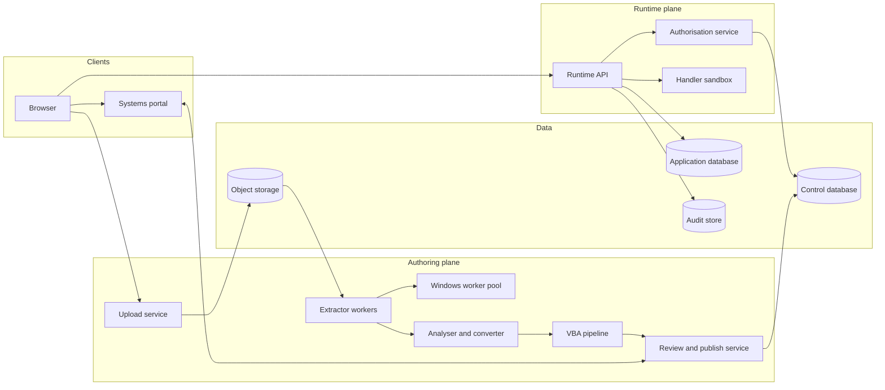

# Access2Web technical design document

| Field | Value |
|---|---|
| Status | Draft for review |
| Owner | Clint Jenkinson |
| Date | 2 October 2026 |
| Version | 0.1 |
| Implements | [Product requirements document](PRD.md) version 0.2 |

## Summary

This document describes how to build Access2Web, a system that converts Microsoft Access databases into web applications, publishes them in the systems portal, and controls who can use each one.

The design rests on one decision: the system does not generate and deploy source code for each application. It generates a versioned **application definition** (a JSON document) and runs every application on one shared, metadata-driven runtime. This choice keeps permission checks, audit logging, and upgrades in one place.

## Status of decisions

The PRD leaves several choices open. This document proposes an answer for each one so that design can proceed. Table 1 lists them. The owner must confirm or change each before build starts.

**Table 1. Proposed decisions**

| Decision | Proposal | Reason | Status |
|---|---|---|---|
| Database engine | PostgreSQL 16 | Row-level security, schemas, and generated columns match the access-control model | Proposed |
| Sign-in standard | OpenID Connect (OIDC) | Widely supported by portals and directory services | Proposed, depends on the portal |
| Handler language | TypeScript, run in a WebAssembly (Wasm) sandbox | One language across the stack, and a strong isolation boundary | Proposed |
| Table, data, and query extraction | Jackcess (Java) on Linux, cross-checked with mdbtools and a Python reader | Open source, reads `.mdb` and `.accdb`, and needs no Access licence | Proposed, needs spike 1 |
| Form, report, macro, and VBA extraction | Windows Server worker that drives Microsoft Access with PowerShell | No open source tool found that reads form and report definitions. The owner has run this kind of automation on server operating systems. | Proposed, needs spike 1 |
| AI service for translation | Provider interface, with a private deployment option | The organisation might not allow VBA source to leave its network | Open |
| Hosting | Containers on the organisation's platform, with a small Windows worker pool | Matches existing operations | Proposed |

## Goals and constraints

The design must meet the requirements in the PRD. These constraints shape it most:

- Permission checks must happen on the server, for every request, and must deny by default.
- Uploaded files and VBA source are untrusted. The system never runs uploaded VBA.
- Conversion is partial by nature. The system must report what it did not convert, and must never hide a gap.
- Each application's data must be isolated from every other application's data.
- The audit log must be append-only.

## Architecture overview

Access2Web has two planes:

- **Authoring plane:** imports, analyses, converts, and publishes applications. Application owners use it.
- **Runtime plane:** serves published applications to users. It also enforces permissions and writes the audit log.

Figure 1 shows the components. In the figure, the browser calls the portal and the runtime API. The runtime API calls the authorisation service, the application database, the audit store, and the handler sandbox. The authoring services read uploaded files from object storage and write application definitions to the control database.



**Figure 1. Component overview**

### Components

Table 2 lists each component and its responsibility.

**Table 2. Components**

| Component | Responsibility |
|---|---|
| Upload service | Receives files, checks size and type, scans for malware, and stores the file in object storage |
| Extractor workers | Read tables, data, relationships, indexes, and saved queries from the file without Access |
| Windows worker pool | Export forms, reports, macros, and VBA source as text by using Access automation in a disposable environment |
| Analyser and converter | Builds the application definition, migrates data, and produces the conversion report |
| VBA pipeline | Classifies procedures, applies fixed mappings, and calls the translation service |
| Review and publish service | Shows the conversion report and handler reviews, records approvals, and registers the application with the portal |
| Runtime API | Serves every published application, and applies permissions and audit logging |
| Authorisation service | Resolves effective permissions for a user and an object |
| Handler sandbox | Runs approved handlers with a restricted host interface |
| Control database | Holds platform metadata: applications, versions, grants, and approvals |
| Application database | Holds migrated data, with one schema for each application |
| Audit store | Holds the append-only audit log |

## Application definition

The application definition is the central artefact. The analyser writes it, the review service lets owners edit it, and the runtime interprets it. It is versioned and immutable after publication.

A definition contains:

- Entities (tables), with fields, types, keys, and relationships.
- Query views, stored as translated PostgreSQL SQL with typed parameters.
- Forms, as a tree of layout nodes and bound controls.
- Reports, as grouping, sorting, and layout rules.
- Rules: validation, defaults, and show or hide conditions, in a small declarative expression language.
- Handlers: references to approved TypeScript modules, keyed by the event that triggers them.
- Conversion notes: the status and reason for each source object.

The following excerpt shows the shape of a definition:

```json
{
  "app": "inventory",
  "version": 3,
  "entities": [
    { "name": "Product", "fields": [
      { "name": "ProductId", "type": "serial", "key": true },
      { "name": "Price", "type": "numeric(19,4)", "required": true }
    ]}
  ],
  "forms": [
    { "name": "ProductForm", "source": "Product", "controls": [
      { "type": "text", "bind": "Price",
        "rules": [{ "validate": "value >= 0", "message": "Price must not be negative" }] }
    ]}
  ],
  "handlers": [
    { "event": "ProductForm.BeforeUpdate", "module": "handlers/product-before-update.ts", "approvedBy": "owner" }
  ]
}
```

### Why not generate source code

The design considered generating a code project for each application. It rejected this for three reasons:

- Each generated project would need its own build, deployment, and security review.
- Permission and audit code would be duplicated across applications, so a fix would need to reach every application.
- Owners would edit generated code, and the system could no longer re-import an updated database safely.

The cost of the chosen design is that the runtime must support every control and rule type the converter can emit. The runtime must therefore be the most thoroughly tested part of the system.

## Import and extraction

### Two-tier extraction

The Access file format is not publicly documented, and the open source tools differ in what they read. The system therefore uses two tiers:

1. **Native tier.** Open source libraries read tables, data, relationships, indexes, and saved query SQL on Linux. No Access licence is needed.
2. **Automation tier.** A Windows Server worker opens the file in Microsoft Access and exports forms, reports, macros, and modules as text by using the `SaveAsText` method. The exported text is the input to the converter.

Table 3 lists the open source tools that apply to the native tier.

**Table 3. Open source tools for the native tier**

| Tool | Language | Reads | Limits |
|---|---|---|---|
| [Jackcess](https://jackcess.sourceforge.io/) | Java | Tables, data, relationships, indexes, read-only query information, passwords, and complex types, for `.mdb` and `.accdb` from Access 2000 to 2019 | Does not read form, report, or VBA definitions |
| [UCanAccess](https://ucanaccess.sourceforge.net/site.html) | Java | Everything Jackcess reads, with a JDBC interface and SQL execution through HSQLDB | SQL runs in HSQLDB, so results can differ from Access. Useful as a test aid, not as the source of truth. |
| [mdbtools](https://github.com/mdbtools/mdbtools) | C | Tables, data, schema, properties, and saved query SQL, for `.mdb` and `.accdb` | Small SQL subset. Use as a cross-check on Jackcess. |
| [access-parser](https://pypi.org/project/access-parser) | Python | Tables and data | No encryption support, and it parses the whole file into memory |
| pyaccdb | Python | Tables and data, including password-protected files with Agile Encryption | Read-only, and it is not a SQL engine |

The primary choice is Jackcess, because it has the widest coverage and an active release history. The other tools are cross-checks and test aids. The survey found no open source tool that reads form or report definitions, so the automation tier remains necessary for forms and reports.

The VBA position is less clear. Public write-ups describe compressed VBA streams inside `.accdb` files that a tool can detect and decompress, which could remove the need for Access for VBA source. No maintained tool was found, and the survey did not verify the method. Spike 1 includes a time-boxed attempt, because success would make VBA extraction possible on Linux.

### Automation tier on Windows Server

The owner has automated Access with PowerShell on server operating systems, and the worker builds on that experience. Two constraints remain:

- Microsoft does not support unattended Automation of Office applications, and states that Office can be unstable or deadlock in that setting. The Access Runtime and the Database Engine Redistributable count as Office components. See [Considerations for server-side Automation of Office](https://support.microsoft.com/help/257757).
- Microsoft states that using server-side Automation to provide Office functionality to unlicensed workstations is not covered by the end user licence agreement. The organisation must confirm that its licensing covers this use.

The worker design must therefore assume that Access can hang or crash. It must apply a time limit to each job, kill the process on timeout, and restart the environment between jobs. Spike 1 measures how often failures occur.

No one has verified that the two tiers together cover every Access version and feature the organisation uses. Spike 1 must test them on real files before the design is final. If the organisation cannot accept the automation tier, the system loses form, report, and VBA conversion unless the native VBA method works, and the PRD scope must change.

### Isolation of the Windows worker

Opening an untrusted file in Access is a risk, so the worker pool applies these controls:

- Each job runs in a fresh, disposable environment that is destroyed after the job. The environment is a VM, or a Hyper-V-isolated Windows container if Spike 1 shows that it is acceptable.
- The environment has no network access, and no credentials.
- The worker sets the automation security level to force-disable macros before opening the file, so no `AutoExec` macro or VBA runs.
- The worker enforces a time limit and a memory limit for each job.
- The worker copies only the exported text out of the environment.

### Data migration

The converter creates one PostgreSQL schema for each application, and loads rows in batches. Table 4 lists the type mapping.

**Table 4. Access to PostgreSQL type mapping**

| Access type | PostgreSQL type | Note |
|---|---|---|
| Short Text | `varchar(n)` | Uses the field size from the source |
| Long Text | `text` | Rich text is stored as HTML |
| Number (Byte, Integer) | `smallint` | Byte maps to `smallint` because PostgreSQL has no one-byte integer |
| Number (Long Integer) | `integer` | |
| Number (Single, Double) | `real`, `double precision` | |
| Number (Decimal) | `numeric(p,s)` | |
| Currency | `numeric(19,4)` | |
| Date/Time | `timestamp` | Access has no time zone, so none is assumed |
| Yes/No | `boolean` | |
| AutoNumber | `integer generated by default as identity` | The sequence starts above the highest migrated value |
| Hyperlink | `text` | |
| OLE Object, Attachment | Object storage reference | Binary data moves to object storage, with a reference in the row |
| Multi-value field | Junction table | |
| Calculated field | Generated column, or a view column | Falls back to a conversion note if the expression cannot translate |

The migration must also:

- Create primary keys, foreign keys, indexes, and required-field constraints.
- Reconcile row counts for every table, and fail the job if counts differ.
- Report orphaned rows that violate a relationship, instead of dropping them.

### Query translation

Access queries use Jet SQL, which differs from PostgreSQL. The converter includes a Jet SQL parser and a transpiler. It must handle at least:

- `IIf` to `CASE`, `Nz` to `COALESCE`, and `&` concatenation to `||`.
- `#` date literals, and `*` and `?` wildcards in `LIKE`.
- `Format`, `DateAdd`, `DateDiff`, `Left`, `Mid`, and similar functions, through a function map.
- `TRANSFORM` and `PIVOT` (crosstab queries), through a pivot step in the runtime.
- Parameter queries, converted to typed, bound parameters.
- Domain aggregate functions such as `DLookup`, converted to subqueries.

When a query uses a construct the transpiler does not support, the converter marks the query as not converted and records the reason. The transpiler must never emit a query it cannot test.

## VBA pipeline

The pipeline never executes VBA. It works on exported source text only.

### Stages

1. **Parse.** Parse each module into procedures, and link each procedure to the form, report, or control that calls it.
2. **Classify.** Assign each procedure to one of the three classes in the PRD: standard pattern, translatable logic, or manual redesign. Classification uses rules first, for example any reference to `CreateObject`, `Declare`, or `Open ... For` marks a procedure as manual redesign. A model classifies only the procedures the rules cannot decide.
3. **Map.** Convert standard patterns to declarative rules by a fixed mapping. For example, `Me.Field.Visible = False` becomes a show or hide rule. No model is involved.
4. **Translate.** Send translatable procedures to the translation service. The request includes the procedure source, the entity and field definitions it uses, and the handler interface.
5. **Check.** Parse the generated TypeScript, and reject it if it uses anything outside the handler interface.
6. **Test.** Run the tests in the sandbox, and record results.
7. **Review.** Show original and generated code side by side. The owner approves or excludes each handler.

### Handler interface

A handler receives a context object and can call only the functions the host provides:

- `ctx.user`: the user's identity and roles, read-only.
- `ctx.record`: the current record, with the old and new values for update events.
- `db.query(sql, params)`: a parameterised query, limited to the application's schema and filtered by the user's permissions.
- `ui.message(text)`, `ui.setVisible(control, value)`, and similar calls that return instructions to the browser.

Handlers have no network, file system, clock, or random-number access beyond the host functions. This is what makes a handler safe to run with real data.

### Tests

The system generates test cases from the procedure and from sample rows. The original code is not available as an oracle, because the system does not run it. The test report therefore shows each case as an input and an expected output, and the owner confirms or corrects each expected output during review. A test the owner has not confirmed does not count towards approval.

### Sandbox

The sandbox runs handlers in a Wasm JavaScript engine, such as QuickJS compiled to Wasm. Each call:

- Starts from a clean instance.
- Has a time limit and a memory limit.
- Cannot import modules except the host interface.
- Writes data only through the transaction that the runtime API owns, so a failed handler rolls back with the request.

### Translation service

The translation service is an interface with two implementations: a hosted AI service, and a private deployment. Which one is allowed is an open question, because VBA source can contain credentials and business rules. The pipeline must therefore strip string literals that match credential patterns before it sends source out, and must log every request.

## Authorisation

### Model

A **grant** gives a **subject** a **permission level** on a **resource**. The design uses these definitions:

- A subject is a user, a directory group, or a role.
- A resource is an application, or an object inside it: a table, a form, or a report.
- A permission level is one of the six levels in the PRD.

### Resolving permissions

To decide whether a user can do an action on an object, the authorisation service applies these rules in order:

1. Collect the user's identities: the user, the user's groups, and the user's roles.
2. If any grant for those identities exists on the object itself, use only the grants on that object.
3. Otherwise, use the grants on the application.
4. Allow the action if any collected grant includes the required level.
5. If no grant applies, deny.

Version 1 has no explicit deny grants. Whether the organisation needs them is an open question.

### Enforcement

The system enforces permissions in three places:

- **Portal tile list.** The portal adapter returns only applications on which the user has the open level.
- **Runtime API.** Every request resolves permissions before it runs. No route skips this step.
- **Database.** Row-level rules compile to PostgreSQL row-level security (RLS) policies. For each request, the runtime sets the user identity as a transaction-local setting, so the policy applies even if an API bug builds the wrong query.

### Changes without sign-in

The token carries identity only. The authorisation service resolves groups and grants on the server, and caches them for at most 60 seconds. A change to a grant or group membership publishes an invalidation event, so a permission change takes effect within the cache time and the user does not need to sign in again.

### Default deny

A published application has no grants until the owner adds them. The publish screen shows a summary of who can open the application and requires the owner to confirm it.

## Portal integration

The system defines a `PortalAdapter` interface so the design does not depend on one portal product. The interface has these operations:

- `register(app)`: creates or updates a tile with the name, description, icon, owner, and launch link.
- `unregister(appId)`: removes the tile.
- `visibleTo(userId)`: returns the tiles a user can see.
- `identity(request)`: validates the sign-in token and returns the user and groups.

The launch link has the form `/apps/{slug}`. A user who opens the link without permission gets a page that states they do not have permission and names the application owner.

The portal's API is an assumption in the PRD, and the adapter is the place to absorb its differences. Confirm the portal's integration options before build starts.

## Audit

The runtime writes audit events for sign-in, record changes, report runs, exports, permission changes, and publishing.

For record changes, database triggers capture the old and new values in the same transaction as the change. This design means that no code path can change data without an audit row, and a rolled-back change leaves no row.

The audit store has these properties:

- The application's database roles have insert permission only, with no update or delete.
- Each event stores a hash of the previous event, so removal or change is detectable.
- Tables are partitioned by month, so queries and retention stay manageable.
- Auditors read through a separate role, with search and export.

## Platform data model

Table 5 lists the main tables in the control database.

**Table 5. Control database tables**

| Table | Purpose | Key columns |
|---|---|---|
| `applications` | One row for each application | `id`, `slug`, `name`, `owner_id`, `current_version` |
| `app_versions` | Immutable definitions | `app_id`, `version`, `definition`, `published_at` |
| `import_jobs` | Upload and conversion runs | `id`, `app_id`, `status`, `source_object_key` |
| `conversion_items` | One row for each source object | `job_id`, `object_type`, `name`, `status`, `reason` |
| `handlers` | Translated procedures | `app_id`, `procedure`, `class`, `source`, `generated`, `approved_by`, `approved_at` |
| `grants` | Permission grants | `subject_type`, `subject_id`, `resource_type`, `resource_id`, `level` |

## API outline

Table 6 lists the main API groups.

**Table 6. API groups**

| Group | Example operations | Caller |
|---|---|---|
| Authoring | Create an import job, get the conversion report, edit a definition, approve a handler, publish | Application owner |
| Administration | Manage roles, view all applications, unpublish | Platform administrator |
| Permissions | List, create, and delete grants | Application owner, platform administrator |
| Runtime | Read, create, update, and delete records, run a query view, run a report, export | Application user |
| Audit | Search and export events | Auditor |

Runtime routes use the form `/api/apps/{slug}/...`. Every response for a denied request uses the same status and message, so a user cannot tell whether a hidden application exists.

## Threats and mitigations

Table 7 lists the main threats and how the design addresses them.

**Table 7. Threats and mitigations**

| Threat | Mitigation |
|---|---|
| Uploaded file carries malware | Scan on upload, and open files only in disposable environments or in a parser with no network |
| Embedded macro runs when Access opens the file | Force-disable automation security, and run in an environment that is destroyed after the job |
| Generated handler leaks or destroys data | Sandbox, restricted host interface, time and memory limits, owner review |
| SQL injection through translated queries or handlers | Bind all parameters, and reject string-built SQL in generated code |
| User reads another application's data | One schema and one database role for each application, plus RLS |
| User bypasses the interface and calls the API | Server-side permission checks on every route |
| Audit log tampering | Insert-only roles and a hash chain |
| Credentials in VBA source leave the network | Strip credential patterns, log requests, and offer a private translation deployment |

## Non-functional design

Table 8 shows how the design meets the PRD's non-functional requirements.

**Table 8. Non-functional requirements and design response**

| Requirement | Design response |
|---|---|
| Open a form with 1,000 records in under 2 seconds | Server-side paging, indexes from the source, cached permission results, and query plans checked in tests |
| 2,000 concurrent users and 200 applications | Stateless runtime API instances behind a load balancer, and a connection pool for each application role |
| 99.5% availability in business hours | At least two runtime instances, a replicated database, and health checks. Authoring services can have lower availability. |
| Encryption | TLS 1.2 or later in transit, and disk and object storage encryption at rest |
| Accessibility (WCAG 2.2 level AA) | Accessible component library, and automated and manual checks on generated forms |
| Backup | Daily backups, and a quarterly restore test |

## Testing strategy

The test plan has these parts:

- **Conversion corpus.** A set of real Access files, with expected conversion reports. Every converter change runs against it.
- **Permission matrix tests.** Automated tests for each role, resource, and level, including the cases that must deny.
- **Runtime component tests.** Each control and rule type has tests on its own.
- **Sandbox escape tests.** A suite of hostile handlers that try to reach the network, file system, and other schemas.
- **Load tests.** Run against the targets in Table 8.
- **Security review.** A penetration test before the first production release.

## Delivery plan

Work follows the phases in the PRD. Three spikes come first, because they test the assumptions that carry the most risk. Table 9 lists them.

**Table 9. Spikes**

| Spike | Question | Pass condition |
|---|---|---|
| 1. Extraction | Can native parsing and Access automation together extract tables, forms, reports, macros, and VBA from real files? | At least 90% of objects in 3 real databases extract without errors |
| 2. Query translation | Can a Jet SQL transpiler convert the organisation's queries? | At least 80% of queries in the same databases convert and return matching results |
| 3. Handler sandbox | Can a Wasm sandbox run realistic handlers within limits? | Hostile handlers fail safely, and normal handlers run within 100 ms |

The thresholds in Table 9 are proposals. The owner must set them.

## Open questions

- Which portal does the organisation use, and what registration and identity options does it offer?
- Does the organisation's Microsoft licensing cover running Access on a Windows Server worker pool, and does the security owner accept use that Microsoft does not support?
- Can the VBA extraction method for `.accdb` files, which avoids Access, be made reliable?
- Does the organisation need explicit deny grants?
- Where must data live, and does any application hold data that needs a privacy review?
- Which translation service is allowed, and does the data policy permit it?
- Who maintains handlers after publication, and how does an owner change one?
- How does a re-import (FR-12) merge changes with an owner's edits to the definition?

## Risks

- The automation tier might not meet cost, licence, or security requirements, and Microsoft does not support unattended Automation of Office. Access can hang, so the design assumes failures and limits each job. Spike 1 tests this first.
- The runtime must support every control and rule type. A gap shows up as a conversion failure for owners, so the conversion corpus must cover the controls in use.
- Jet SQL has many edge cases. Query translation could take longer than planned, and the fallback is to mark queries as not converted.
- Owner review of handlers is a human bottleneck. If owners approve without reading, the safeguards fail, so the review screen must show test results and the original code, and the audit log must record every approval.
